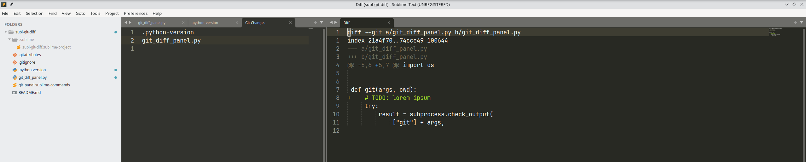

# Git Diff Panel for Sublime Text

A lightweight Sublime Text plugin that provides a **Git changes panel**.
It displays modified files on the left and a **live Git diff viewer** on the right.

This makes it easy to quickly browse changes in a repository without leaving the editor.

---

## Features

* **two-panel layout**
* **Left panel:** list of modified files
* **Right panel:** Git diff viewer
* Press **Enter** on a file to display its diff
* **Automatically saves and restores your previous layout**
* Works with any Git repository opened as a project folder
* Minimal and fast (no external dependencies)

---

## Preview

```
+----------------------+----------------------------------+
| Git Changes          | Git Diff                         |
|----------------------|----------------------------------|
| src/app.py           | diff --git a/src/app.py          |
| src/api/user.js      | + added code                     |
| README.md            | - removed code                   |
| package.json         |                                  |
+----------------------+----------------------------------+
```



---

## Keybinding (Open Diff)

Create or edit:

```
Packages/User/Default.sublime-keymap
```

Add:

```json
[
    {
        "keys": ["enter"],
        "command": "git_open_diff",
        "context": [
            { "key": "setting.git_panel", "operator": "equal", "operand": true }
        ]
    }
]
```

This allows pressing **Enter** on a file in the changes list to show its diff.

---

## Usage

### Open the Git Changes Panel

Open the command palette:

```
Ctrl + Shift + P
```

Run:

```
Git: Open Changes Panel
```

The editor layout will change to show:

* **Left:** modified files
* **Right:** diff view

---

### View File Changes

1. Select a file in **Git Changes**
2. Press:

```
Enter
```

The diff will appear in the **Git Diff** panel.

---

### Close the Panel

Open the command palette:

```
Ctrl + Shift + P
```

Run:

```
Git: Close Changes Panel
```

Your **previous editor layout will automatically be restored**.

---

## Requirements

* Sublime Text 3 or 4
* Git installed and available in your system PATH
* A project folder that contains a Git repository

---

## Limitations

* Only shows **modified files detected by Git**
* Does not yet support:

  * staging/unstaging
  * commit UI
  * side-by-side diffs
  * file tree view

---

## Possible Improvements

Future enhancements could include:

* Git status icons (`A`, `M`, `D`)
* side-by-side diff view
* stage / unstage actions
* automatic refresh on file changes
* hierarchical file tree
* integration with the Sublime sidebar

---

## License

MIT License
